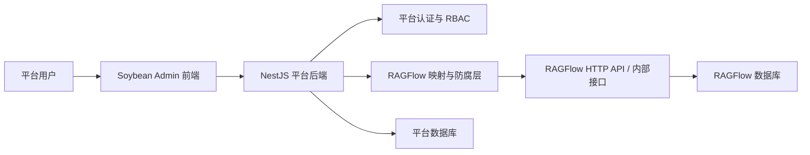
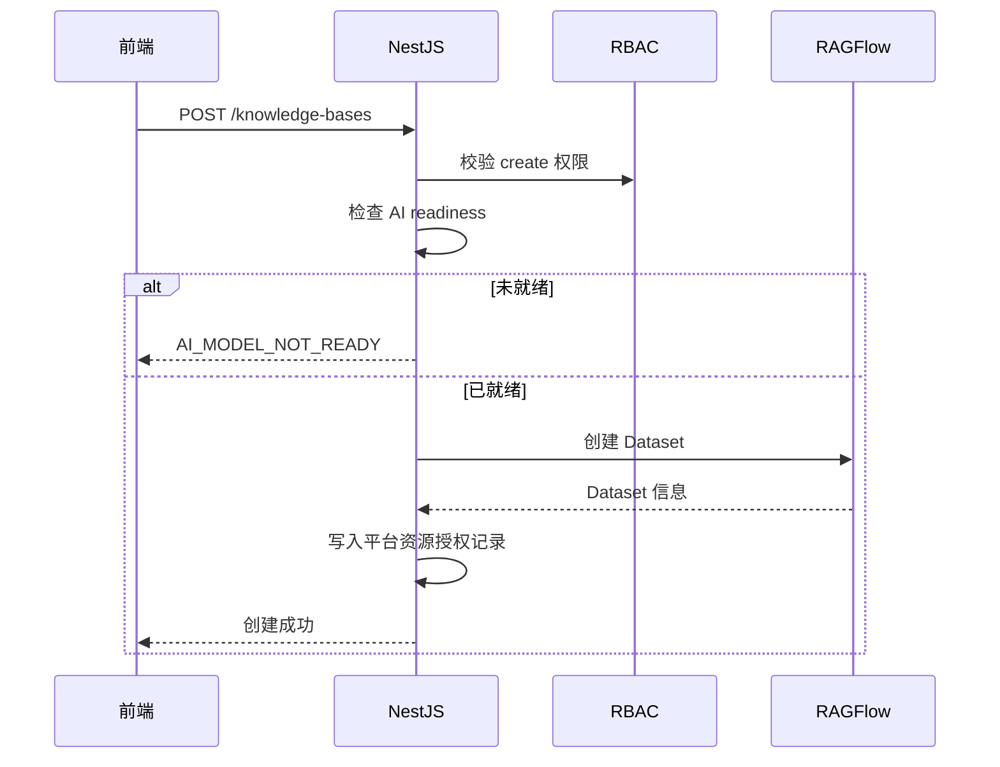

# AI 中枢导航与模型配置规划

> 本文档定义「AI 中枢」的菜单结构、模型初始化、RAGFlow 默认模型对接、就绪状态、权限边界和阶段性交付范围。
> 目标不是复刻 RAGFlow 页面，而是在自建企业平台中以统一入口承载 RAG 能力，并避免普通用户接触 RAGFlow 的模型配置阻断。

## 0. 审核修订（2026-05-29）

本节记录对初版 spec 的审核结论与修改原因，供后续执行者理解每处调整的依据。

### 已修正（正确性）

| # | 问题 | 修改 | 原因 |
|---|------|------|------|
| 1 | §3.2 模型接口路径 `GET/PATCH /api/v1/users/me/models` 未被 03 文档记录 | 改为「✅ 源码已确认」 | 本地 RAGFlow 源码 `api/apps/restful_apis/user_api.py` 已确认存在 `@manager.route("/users/me/models", methods=["GET"])` 和 `PATCH`；03 文档是梳理遗漏，不应反向否定源码 |
| 2 | §7.2 返回示例用 `code:0 / message`（RAGFlow 格式） | 统一为平台格式 `code:200 / msg / data` | 平台标准响应是 `{code:200,msg:"ok",data}`，前端 `VITE_SERVICE_SUCCESS_CODE=200`，用 0 会判错成功码 |
| 3 | §9.1 顶部导航列出「记忆」，与 §2.2、§4.1「不做记忆菜单」矛盾 | 从顶部导航移除「记忆」 | 记忆是 Chat/Agent 内部依赖，不暴露为独立菜单（03 文档 2.8 节同结论） |
| 8 | 权限标识用三段 `ai:knowledge:view` | 改为两段 `模块:操作`（`knowledge:view`） | 与现有约定（`user:add`、`role:edit`，见 remaining-features 计划）保持一致 |
| 9 | 接口路径 `/ai-hub/readiness`（REST 名词风） | 改为 `/ai-hub/getReadiness` | 与现有 `getXxx` 风格一致（`/systemManage/getUserList`、`/auth/getUserInfo`） |
| 10 | 初版设计了 `ai_ragflow_account_binding` / `RagflowAccountBinding` | 本期删除绑定表设计 | 已拍板单 RAGFlow 账户方案，无「组织/部门 → tenant」映射关系；保留绑定表只会增加无效复杂度 |

### 已决策（2026-05-29 拍板）

| # | 议题 | 决策 | 理由 |
|---|------|------|------|
| 4 / 5 / 6 | tenant 隔离粒度 + 「组织」实体 + 绑定表 | **采用方案 A：全平台共用 1 个 RAGFlow 账户（1 个 tenant），隔离 100% 由 Soybean RBAC + 知识库归属部门控制** | 本期为第十三师新星市单客户私有部署，截图中的「师领导 / 团场 / 企业单位 / 事业单位 / 公检法司 / 师机关」更像同一平台内的部门树，不是多租户 SaaS；不引入「组织/部门级 tenant」物理隔离，不新建 Organization 实体，不需要 `RagflowAccountBinding` 映射表，复杂度最低 |

> 前提：单账户方案只适用于**用户不直连 RAGFlow**的 API 集成模式。如果继续 iframe 嵌入 RAGFlow 原生页面，单账户会导致所有用户在 RAGFlow 里看到同一工作空间内的全部知识库，平台 RBAC 无法兜底。
>
> 备注：公检法司等敏感单元如果只是填报指标类公开/半公开数据，本期可逻辑隔离；如果要上传敏感案卷、内部执法材料、涉密或准涉密资料，则不能只靠单 RAGFlow tenant，必须单独做物理隔离评估。

### 已决策（Embedding 约束）

| # | 议题 | 影响 | 原因 |
|---|------|------|------|
| 7 | RAGFlow 中 dataset 的 Embedding 建库后不可改 | Phase 1A 禁止在已有知识库时切换默认 Embedding；只允许修改 LLM / Rerank | 避免新老知识库向量空间不一致，导致跨库检索和后续问答异常；如必须切换 Embedding，后续做“重建索引/重新解析”迁移流程 |

---

## 1. 背景与结论

RAGFlow 在创建知识库前要求当前租户已配置 LLM 和 Embedding。未配置时，RAGFlow 原生页面会弹出提示，并跳转到「模型提供商 / 设置默认模型」页面。

在本平台中，这个行为不能原样暴露给终端用户。企业平台的合理体验是：

- 管理员完成一次 AI 能力初始化。
- 普通用户创建知识库、上传文档、检索和问答时，不需要理解模型提供商、默认模型、API Key 等底层概念。
- NestJS 作为唯一后端入口，对 RAGFlow 做防腐层封装和预检，前端不直接调用 RAGFlow 内部接口。

因此，本文档的核心结论是：

1. 「知识库」菜单升级为「AI 中枢」，作为 AI 能力总入口。
2. 模型配置属于平台管理能力，只对管理员开放。
3. 知识库创建前必须由后端做就绪预检，未就绪时返回平台错误码，而不是让 RAGFlow 报错透传到前端。
4. **全平台共用 1 个 RAGFlow 账户（1 个 tenant）**：所有知识库、Agent 都在这个工作空间内；模型只需配置一次；**"谁能看什么"100% 由 Soybean RBAC + 知识库归属部门控制**，RAGFlow 自身不做隔离。员工不接触 RAGFlow，NestJS 用该账户的 API Key 代理所有请求。

---

## 2. 目标与非目标

### 2.1 目标

- 建立「AI 中枢」父菜单，承载知识库、智能问答、智能体、模型配置等能力。
- 提供管理员可用的模型初始化与默认模型配置能力。
- 保证知识库创建、文档解析、检索问答不会因为缺少默认模型进入无限 loading 或 RAGFlow 原生弹窗。
- 使用 Soybean Admin + Naive UI 做企业中后台风格页面。
- 所有 RAGFlow 调用都通过 NestJS 防腐层，不在前端暴露 RAGFlow API Key、RAGFlow session、RAGFlow 原始错误结构。

### 2.2 非目标

- 第一阶段不迁移 RAGFlow 的 Team 页面。组织、部门、角色、资源授权由自建平台管理。
- 第一阶段不做 MCP 独立菜单。
- 第一阶段不做完整运行监控大盘，只保留日志和基础就绪状态。
- 第一阶段不允许普通用户自行选择 LLM 或 Embedding。

---

## 3. 总体架构



### 3.1 调用原则

- 前端只调用平台后端。
- 平台后端负责认证、权限、参数校验、错误转换、审计日志。
- RAGFlow API Key 或登录态只保存在后端安全存储中，前端不可见。
- RAGFlow 原始接口变化只影响 `ragflow-api.service.ts` 防腐层，不扩散到 Controller、前端页面和业务权限模型。

### 3.2 RAGFlow 事实边界

当前本地 RAGFlow 版本中，与模型配置相关的事实边界如下：

| 能力 | RAGFlow 接口 | 核实状态 | 说明 |
|---|---|---|---|
| 配置模型提供商 Key | `POST /api/v1/llm/set_api_key` | ✅ 已记录于 03 文档 | 依赖 RAGFlow 当前用户上下文 |
| 添加模型 | `POST /api/v1/llm/add_llm` | ✅ 已记录于 03 文档 | 依赖 RAGFlow 当前用户上下文 |
| 查询当前租户模型 | `GET /api/v1/llm/my_llms` | ✅ 已记录于 03 文档 | 返回当前租户已配置模型 |
| 查询默认模型 | `GET /api/v1/users/me/models` | ✅ 源码已确认 | `api/apps/restful_apis/user_api.py` 中 `tenant_info()` |
| 设置默认模型 | `PATCH /api/v1/users/me/models` | ✅ 源码已确认 | `api/apps/restful_apis/user_api.py` 中 `set_tenant_info()`，请求体需要 `tenant_id`、`llm_id`、`embd_id`、`asr_id`、`img2txt_id` |

> 说明：这些接口在 RAGFlow 版本升级时可能变化，必须集中封装在 `RagflowApiService` 防腐层；当前 spec 以本项目已 clone 的 RAGFlow 版本为准，后续升级由防腐层统一适配。

---

## 4. 菜单结构与阶段规划

### 4.1 菜单结构

「AI 中枢」作为父菜单，下挂以下子菜单：

| 子菜单 | 作用 | 谁可见 | RAGFlow 能力 | 阶段 |
|---|---|---|---|---|
| 知识库 | 知识库 CRUD、文档上传、解析、检索入口 | 按资源权限 | Dataset / Document | Phase 1A |
| 模型配置 | 接入模型提供商、设置默认 LLM / Embedding / Rerank | 管理员 | LLM / Tenant Model | Phase 1A |
| 智能问答 | 基于知识库的 RAG 问答 | 按资源权限 | Chat / Retrieval | Phase 1B |
| 智能体 | 数字员工 / Agent 配置与调用 | 按资源权限 | Agent | Phase 1C |
| 数据源 | 文件来源、外部数据接入、同步任务 | 管理员 | Document / File | Phase 2 |
| 运行监控 | 解析任务、调用量、Token、错误日志 | 管理员 | Task / Log | Phase 2 |

### 4.2 分阶段交付

#### Phase 1A：模型就绪 + 知识库闭环

必须先完成：

- AI 中枢导航。
- 模型配置页面。
- AI 能力初始化向导。
- 就绪检测接口。
- 知识库列表、创建、删除、基础详情。
- 创建知识库前的后端预检。

Phase 1A 的验收标准是：管理员配置模型后，普通用户可以正常创建知识库，不出现 RAGFlow 的模型配置弹窗。

#### Phase 1B：智能问答

在 Phase 1A 稳定后再做：

- 选择知识库发起问答。
- 展示引用片段。
- 问答权限按知识库资源授权控制。

#### Phase 1C：智能体 / 数字员工

在知识库和问答可用后再做：

- 数字员工配置。
- Skill 配置。
- 可调用系统接口的工具授权。
- 数字员工与知识库、接口权限绑定。

#### Phase 2：数据源与运行监控

有真实使用量后再做：

- 外部数据源。
- 批量同步任务。
- 解析任务监控。
- Token 与费用统计。
- 操作审计和异常分析。

---

## 5. 身份与 RAGFlow 账户模型（方案 A：单账户）

> **本节为已决策内容（2026-05-29）。** 见 §0「已决策」#4/5/6。

### 5.1 核心模型

**全平台共用 1 个 RAGFlow 账户（= 1 个工作空间 / tenant）。**

- 平台认证是唯一登录入口。用户登录本平台后，不进入 RAGFlow 登录页，也不在前端填写 RAGFlow API Key。
- 所有 Soybean 用户在 RAGFlow 眼里都是**同一个账户**；NestJS 用这一个账户的 API Key 代理所有人的请求。
- 员工**不需要**在 RAGFlow 注册账号，**不使用** RAGFlow 的「团队/成员」功能（开源版团队成员还无法共享模型，本就不适用）。
- 所有知识库、Agent 都在这个唯一工作空间内，是**共享资源池**。

### 5.2 隔离方式：100% 由平台 RBAC 控制

RAGFlow 自身**不做任何隔离**。"谁能看哪个知识库 / Agent、谁能上传、谁能检索"全部由：

1. **Soybean RBAC**（菜单/按钮/接口权限）；
2. **知识库归属部门 + 资源授权**（知识库属于哪个部门、授权给哪些角色/用户）。

二者共同决定可见性。详见 §10 权限设计。

> ⚠️ **实现红线**：因为 RAGFlow 不兜底，任何涉及 `datasetId` 的接口都必须在 Service 层校验"当前用户对该知识库是否有权限"，不能只靠前端隐藏。此处必须有针对性测试（越权用例），不能只靠人工点。

> ⚠️ **产品红线**：本方案下不允许普通用户 iframe 打开 RAGFlow 原生页面，也不允许把 RAGFlow 地址、API Key、session 暴露到浏览器。右侧页面只能做成“RAGFlow 风格”的自研页面，通过 NestJS API 调用 RAGFlow。

### 5.3 API Key 配置

- 单账户的 API Key 存于后端安全配置（当前为 `.env` 的 `RAGFLOW_API_KEY`），不暴露给前端。
- 由于是单账户，**本期不需要** `RagflowAccountBinding` 映射表、不需要"组织/部门 → tenant"映射、不需要新建 Organization 实体。
- 模型也只需在这个唯一账户里配置一次（见 §6）。

### 5.4 后续扩展（本期不实现）

若将来出现"必须物理隔离"的敏感单元（如公检法司），扩展方式是：为该单元单独建第二个 RAGFlow 账户，并引入"部门 → 账户/Key"映射；本期单账户设计不阻碍该扩展。

### 5.5 实际部门结构落地

当前业务组织不是 SaaS 多租户组织，而是「第十三师新星市」下面的一棵部门树：

- 第十三师新星市
  - 师领导
  - 团场
  - 企业单位
  - 事业单位
  - 公检法司
  - 师机关

第一阶段直接复用现有 `Department` 树即可，不新增 `Organization` 实体。

但知识库资源必须补充部门归属，否则“按部门隔离”只是口号，无法落地：

| 字段 | 建议位置 | 说明 |
|---|---|---|
| `deptId` | `KnowledgeBase` | 知识库归属部门 |
| `ownerId` | `KnowledgeBase` | 创建人 / 负责人 |
| `visibility` | `KnowledgeBase` | `private` / `dept` / `custom` / `public` |
| `embeddingModelId` | `KnowledgeBase` | 创建时使用的 Embedding，支撑后续迁移判断 |

如果后续需要按「师领导 / 团场 / 企业单位」做筛选、统计或不同策略，可在 `Department` 增加 `category` 字段；Phase 1A 可以先不加。

---

## 6. 模型配置设计

### 6.1 产品定位

模型配置是管理员能力，不是普通用户能力。

管理员完成：

1. 接入模型提供商。
2. 添加可用模型。
3. 设置默认 LLM。
4. 设置默认 Embedding。
5. 可选设置 Rerank。
6. 写入平台唯一的 RAGFlow 账户（单 tenant）。

普通用户只看到“AI 能力已就绪”或友好提示，不看到 API Key 和模型厂商密集配置。

### 6.2 页面结构

「模型配置」页面建议分为三块：

1. 顶部状态区
   - 显示平台 AI 能力就绪状态。
   - 显示默认 LLM、Embedding、Rerank。
   - 未就绪时提供「开始初始化」按钮。

2. 模型提供商区
   - 使用 `NCard` 展示 OpenAI、通义千问、DeepSeek、Ollama、本地模型等提供商。
   - 每个卡片展示接入状态、支持能力、最后验证时间。
   - API Key 输入必须使用密码输入框，保存后不回显明文。

3. 默认模型区
   - 使用 `NSelect` 设置默认 LLM。
   - 使用 `NSelect` 设置默认 Embedding。
   - 使用 `NSelect` 设置默认 Rerank，可为空。
   - 保存时后端调用 RAGFlow 默认模型设置接口。

### 6.3 初始化向导

管理员第一次进入 AI 中枢且模型未就绪时，显示初始化向导：

1. 接入模型提供商。
2. 添加或选择 LLM。
3. 添加或选择 Embedding。
4. 设置默认模型。
5. 创建第一个知识库。

非管理员遇到未就绪状态时，不显示向导，只显示：

```text
AI 能力正在初始化，请联系管理员。
```

### 6.4 必要校验

保存默认模型前，后端必须校验：

- 默认 LLM 已存在并可用于当前 RAGFlow tenant。
- 默认 Embedding 已存在并可用于当前 RAGFlow tenant。
- 如果配置 Rerank，Rerank 模型必须存在并可用。
- API Key 不得写入日志。
- RAGFlow 返回失败时，转换为平台错误码和中文提示。

### 6.5 Embedding 不可变约束

RAGFlow 的 dataset 在创建 / 首次解析后会绑定 Embedding 模型。Embedding 变化不是普通配置变更，而是索引体系变化。

Phase 1A 采用保守策略：

- 平台尚无知识库时，管理员可以设置或更换默认 Embedding。
- 平台已有任意知识库后，默认 Embedding 不允许直接切换。
- LLM 和 Rerank 可以继续调整，因为它们不会改变已入库文档的向量空间。
- 创建知识库时，必须把当时使用的 Embedding 写入平台 `KnowledgeBase.embeddingModelId`。
- 后续如确实要更换 Embedding，必须新增“重建索引/重新解析”迁移流程，并提示会影响所有已有知识库。

这样做的原因是：单账户模式下所有知识库未来可能被数字员工或统一问答一起使用。如果新老知识库使用不同 Embedding，跨库检索质量会变得不可控。

---

## 7. 就绪检测

### 7.1 接口

NestJS 提供：

```http
GET /ai-hub/getReadiness
```

> 审核说明（#9）：路径采用 `getXxx` 风格，与现有接口（`/systemManage/getUserList`、`/auth/getUserInfo`）保持一致。

### 7.2 返回结构

> 审核说明（#2）：响应体使用平台统一格式 `{code:200,msg:"ok",data}`，而非 RAGFlow 的 `{code:0,message}`。前端 `VITE_SERVICE_SUCCESS_CODE=200`。

```json
{
  "code": 200,
  "msg": "ok",
  "data": {
    "status": "READY",
    "defaultModels": {
      "llm": {
        "id": "qwen2.5:Qianfan",
        "name": "Qwen2.5",
        "provider": "Qianfan"
      },
      "embedding": {
        "id": "bge-large-zh:Ollama",
        "name": "bge-large-zh",
        "provider": "Ollama"
      },
      "rerank": null
    },
    "missing": [],
    "canInitialize": true
  }
}
```

### 7.3 状态枚举

| 状态 | 含义 | 前端行为 |
|---|---|---|
| `NOT_CONFIGURED` | 尚未接入模型提供商 | 管理员显示初始化向导；普通用户显示友好提示 |
| `PARTIAL` | 已接入部分模型，但缺少 LLM 或 Embedding | 管理员显示待补项；普通用户显示友好提示 |
| `READY` | 默认 LLM 和 Embedding 均可用 | 正常进入知识库 / 问答 |
| `ERROR` | RAGFlow 不可用或配置检测失败 | 显示错误结果页，允许管理员查看原因 |

### 7.4 判断规则

就绪必须同时满足（基于平台唯一 RAGFlow 账户）：

- 平台 RAGFlow API Key 有效、服务可达。
- 该账户已配置默认 LLM。
- 该账户已配置默认 Embedding。
- 默认 LLM 和 Embedding 能在 `my_llms` 或 tenant model 信息中找到。

Rerank 不作为 Phase 1A 强制项。

---

## 8. 创建知识库流程

### 8.1 前端行为

知识库创建弹窗只让用户填写：

- 知识库名称。
- 描述。
- 分块方式。

模型信息以只读形式展示，可按角色控制：

```text
嵌入模型：bge-large-zh · 对话模型：Qwen2.5（平台默认）
```

普通用户不可修改模型。

### 8.2 后端流程



### 8.3 错误码

| 错误码 | 触发条件 | 前端提示 |
|---|---|---|
| `AI_MODEL_NOT_READY` | 默认 LLM 或 Embedding 缺失 | AI 能力尚未初始化，请联系管理员 |
| `RAGFLOW_SERVICE_UNAVAILABLE` | RAGFlow 服务不可用 / API Key 失效 | RAGFlow 服务暂不可用，请稍后重试 |
| `KNOWLEDGE_BASE_CREATE_FAILED` | RAGFlow 创建 dataset 失败 | 知识库创建失败，请稍后重试 |

> 审核说明：单账户模型下不存在"组织绑定 tenant"概念，已移除 `RAGFLOW_TENANT_NOT_BOUND`、`RAGFLOW_MODEL_SYNC_FAILED`（无多 tenant 同步）。

---

## 9. 前端 UI 规范

### 9.1 AI 中枢工作台

右侧内容区可以做成接近 RAGFlow 的简洁工作台风格：

- 顶部胶囊导航：知识库、智能问答、智能体等能力入口。
- 当前 Phase 只开放已实现入口；未实现入口可隐藏或禁用，不做假页面。

> 审核说明（#3）：移除「记忆」入口。记忆是 Chat/Agent 的内部依赖，不暴露为独立菜单（与 §2.2、§4.1 及 03 文档 2.8 节一致）。「文件管理」如需保留应作为知识库详情内的子视图，不在顶部一级导航单列。
- 知识库卡片使用简洁卡片：名称、文件数、更新时间。
- 不在知识库首页展示“当前页、启用、禁用、角色授权”等偏后台统计项。
- 资源权限相关动作进入详情或授权页处理，不占据首页主视觉。

### 9.2 Soybean 外壳处理

AI 中枢页需要降低传统后台感：

- 可隐藏二级面包屑和多标签栏。
- 左侧平台菜单保留，保证统一入口和权限体系存在。
- 主内容区铺满右侧可用空间。
- 页面风格保持白底、轻边框、小圆角、低装饰。

### 9.3 Naive UI 组件映射

| 用途 | 组件 |
|---|---|
| 初始化步骤 | `NSteps` |
| 提供商卡片 | `NCard` |
| 默认模型选择 | `NSelect` |
| 状态标签 | `NTag` |
| 普通用户未就绪提示 | `NResult` |
| API Key 输入 | `NInput` password |
| 保存确认 | `NModal` / `NPopconfirm` |

---

## 10. 权限设计

### 10.1 菜单权限

| 菜单 | 权限标识 | 默认角色 |
|---|---|---|
| AI 中枢 / 知识库 | `knowledge:view` | 管理员、普通用户 |
| 新建知识库 | `knowledge:create` | 管理员、授权用户 |
| 删除知识库 | `knowledge:delete` | 管理员、资源管理员 |
| 模型配置 | `model:config` | 超级管理员、组织管理员 |
| 智能问答 | `chat:view` | 管理员、普通用户 |
| 智能体 | `agent:view` | 管理员、授权用户 |

> 审核说明（#8）：权限标识采用两段 `模块:操作` 格式，与现有约定（`user:add`、`role:edit`，见 remaining-features 计划）一致。

### 10.2 后端权限

所有 AI 中枢接口必须同时校验：

1. 用户已登录平台。
2. 用户拥有对应菜单或资源权限。
3. 涉及具体知识库的操作，校验用户对该知识库（按归属部门 + 资源授权）是否有权限。
4. 平台 AI 能力已就绪（默认模型可用）。

### 10.3 资源授权

知识库是资源，不只是菜单。

平台需要支持：

- 谁可以查看知识库。
- 谁可以上传文档。
- 谁可以执行解析。
- 谁可以检索和问答。
- 谁可以删除知识库。
- 哪些数字员工可以使用该知识库。
- 哪些第三方系统可以调用该知识库能力。

最低落地规则：

1. 超级管理员可见全部知识库。
2. 部门管理员可见本部门及下级部门知识库。
3. 普通用户默认只能看自己创建的知识库、所在部门开放的知识库、被角色/用户显式授权的知识库。
4. 所有文档上传、解析、删除、检索、问答接口都必须复用同一套知识库访问校验。

---

## 11. 后端模块边界

建议后端拆分为以下职责：

| 模块 | 职责 |
|---|---|
| `AiHubController` | AI 中枢就绪检测、初始化入口 |
| `AiHubService` | 编排 readiness、初始化、错误转换 |
| `RagflowApiService` | 封装 RAGFlow HTTP API 和内部接口（单账户 API Key） |
| `AiModelConfigService` | 模型提供商、默认模型配置 |
| `KnowledgeBaseService` | 平台知识库资源、授权、RAGFlow dataset 映射 |

> 审核说明：单账户方案下**不需要** `RagflowAccountBindingService`（无"组织/部门 → tenant"映射）。将来如需为敏感单元拆分独立账户，再引入该服务（见 §5.4）。

防腐层原则：

- Controller 不直接拼 RAGFlow URL。
- 前端 DTO 不直接复用 RAGFlow 原始字段。
- RAGFlow 错误必须转换成平台错误码。
- 所有 API Key、token、cookie、session 日志脱敏。

---

## 12. 数据与安全要求

### 12.1 API Key

- API Key 只允许后端接收、加密、存储、调用。
- 前端保存后不回显明文。
- 日志中只允许显示掩码，例如 `sk-***abcd`。
- 删除模型提供商时，需要确认是否同步删除该账户中的相关模型配置。

### 12.2 审计日志

以下动作必须记录审计日志：

- 接入模型提供商。
- 修改默认 LLM。
- 修改默认 Embedding。
- 初始化平台 AI 能力。
- 创建、删除知识库。
- 授权知识库给用户、角色、数字员工或第三方系统。

### 12.3 幂等与重试

初始化平台 AI 能力必须幂等：

- 默认模型已配置时不重复写入。
- RAGFlow 短暂失败时允许后端重试，但不能让前端无限 loading。

---

## 13. 完成标准

### Phase 1A 完成标准

- [ ] 「知识库」父菜单更名为「AI 中枢」。
- [ ] AI 中枢下至少包含「知识库」「模型配置」两个可用子菜单。
- [ ] 管理员可进入模型配置页，接入模型提供商并设置默认 LLM / Embedding。
- [ ] NestJS 提供 `GET /ai-hub/getReadiness`。
- [ ] readiness 能返回 `NOT_CONFIGURED`、`PARTIAL`、`READY`、`ERROR`。
- [ ] 创建知识库前后端会检查 readiness。
- [ ] 未就绪时返回 `AI_MODEL_NOT_READY`，前端显示友好提示，不透传 RAGFlow alert。
- [ ] 普通用户不可见 API Key，不可进入模型配置页。
- [ ] 普通用户不能 iframe 或直连 RAGFlow 原生页面。
- [ ] 知识库表具备部门归属字段，列表和详情按部门/角色/用户授权过滤。
- [ ] 文档上传、解析、删除、检索接口均有越权测试。
- [ ] 知识库卡片风格接近 RAGFlow：简洁、轻量、少后台统计项。
- [ ] 无报错、无无限 loading、无空白页。

### Phase 1B 完成标准

- [ ] 用户可以选择有权限的知识库进行问答。
- [ ] 回答展示引用来源。
- [ ] 无权限知识库不能被问答接口使用。

### Phase 1C 完成标准

- [ ] 可以创建数字员工。
- [ ] 可以给数字员工配置可用知识库。
- [ ] 可以给数字员工配置 skill 和系统接口权限。
- [ ] 数字员工调用知识库和接口时受平台权限控制。

---

## 14. 当前建议执行顺序

1. 先实现 AI 中枢菜单和知识库首页视觉收敛。
2. 补齐知识库部门归属和资源访问校验，先把单 tenant 的安全前提做实。
3. 在防腐层封装模型相关 RAGFlow 接口。
4. 实现 readiness 接口（基于平台单账户）。
5. 实现模型配置页和默认模型写入。
6. 给创建知识库接口加 readiness preflight。
7. 再进入智能问答。
8. 最后进入数字员工和第三方赋能。

这个顺序的原因是：模型就绪是所有 RAG 能力的底座。如果这一步不稳，后面的问答、智能体、第三方系统赋能都会反复遇到模型缺失问题。单账户方案下无需 tenant 映射这一层，复杂度更低。
